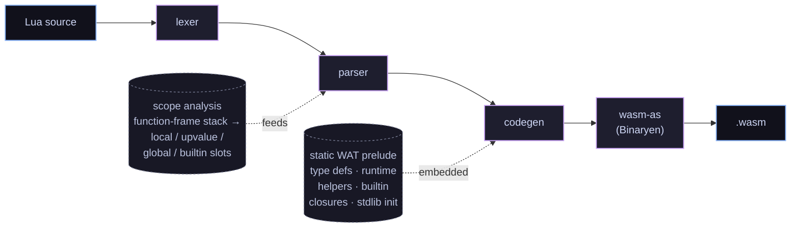

# lua2wasm

**An ahead-of-time compiler that turns Lua 5.5 source into standalone WebAssembly modules — no interpreter, no bytecode VM, no bundled garbage collector.**

`lua2wasm` is written in C23 and emits WebAssembly that leans on the modern WASM
type system (the GC, typed-references, and exception-handling proposals). The
runtime *is* the host: Lua tables are real WASM structs, Lua closures are
typed function references, and the browser's V8/SpiderMonkey collector owns
every Lua value. Compile once, ship a `.wasm`, run anywhere with a recent
browser.

> This is a research / educational project. The long-form mission, non-goals,
> and roadmap live in [`GOAL.md`](GOAL.md).

## Try it now

**Live playground:** <https://rhmoller.github.io/lua2wasm/> — opens an
in-browser editor that compiles and runs your Lua right on the page. No
install needed.

For local development the default flow needs **no Emscripten** — just
`clang`, `cmake`, Binaryen's `wasm-as`, and Node ≥ 22.

```sh
# 1. Build the compiler (a native binary)
CC=clang cmake -S . -B build -G Ninja
cmake --build build

# 2. Compile a Lua program to a .wasm module
echo 'print("hello from " .. "lua2wasm")' > /tmp/hello.lua
./build/lua2wasm /tmp/hello.lua -o /tmp/hello.wat
wasm-as --all-features -o /tmp/hello.wasm /tmp/hello.wat

# 3. Run it
node --experimental-wasm-exnref runtime/host.mjs /tmp/hello.wasm
#   → hello from lua2wasm
```

Or wrap that module up as a self-contained HTML page (no server needed) with
[`scripts/package-html.sh`](scripts/package-html.sh) — see the
[Packaging](#packaging) section below.

### Optional: the live playground

If you also have [Emscripten](https://emscripten.org/) on hand, there's a
richer demo that cross-compiles **the compiler itself** to WASM and ships it
to the browser. A CodeMirror editor on one side, output on the other; **Run**
compiles + runs your Lua entirely client-side, **Show WAT** reveals the
codegen output.

```sh
. ~/path/to/emsdk/emsdk_env.sh
./scripts/build-wasm.sh                  # produces build-em/lua2wasm.{js,wasm}
python3 -m http.server 8000
# open http://localhost:8000/runtime/playground.html
```

Emscripten is *only* needed for this playground page — every other path in
this README works without it.

## A tiny example

```lua
local function counter()
  local n = 0
  return function() n = n + 1; return n end
end

local tick = counter()
print(tick())   -- 1
print(tick())   -- 2
print(tick())   -- 3
```

That compiles to a ~5 KB `.wasm` module. The closure becomes a real
`(ref $LuaClosure)` — a WASM struct holding a typed `funcref` plus an array
of captured upvalue boxes — and is *called* through `call_ref`, the WASM
indirect-call instruction for typed function references. The captured `n` is
shared by reference (a struct cell), not copied, so multiple closures over
the same outer scope mutate the same slot — exactly as Lua specifies.

## What works today

`lua2wasm` is an AOT compiler. There's no Lua interpreter sitting around at
runtime; what you write is what the compiler *statically* lowers to WASM
instructions. Anything not in this table is a compile-time error.

| Area              | Supported                                                                                                                                                                                                                                                                       | Not yet                                                          |
|-------------------|---------------------------------------------------------------------------------------------------------------------------------------------------------------------------------------------------------------------------------------------------------------------------------|------------------------------------------------------------------|
| **Values**        | `nil`, booleans, integers, floats, strings, tables, first-class functions / closures                                                                                                                                                                                                                            | userdata, threads                                                |
| **Numbers**       | int + float subtypes with Lua-compliant promotion (`/` always float, `+ - *` keep int if both ints, `//` floor-div, `%` floor-mod, `^` always float, hex int `0xFF` / `0Xff`, hex float `0x1.8p3`)                                                                                                              | bitwise `& \| ~ << >>` (parsed not codegen'd)                    |
| **Strings**       | single / double-quoted with full escape set (`\n \t \\ \" \' \0 \a \b \f \r \v \xHH \ddd \u{…} \z \<line-break>`), **long-bracket `[[ ... ]]`** and level-N `[=[ ... ]=]`, concat `..` (with `__concat`), length `#` (with `__len`), structural equality                                                         | —                                                                |
| **Tables**        | array part + hash part, positional / named / `[expr]=` constructors, `t.k` and `t[k]` read+write, nil-assignment delete, `#t` border rule, nesting, identity equality via `ref.eq` (table keys work as in Lua)                                                                                                  | metatable performance tricks                                     |
| **Locals**        | `local x`, `local x, y, z = …`, lexical block scoping, shadowing                                                                                                                                                                                                                                                | `<const>` / `<close>` attributes                                 |
| **Globals**       | Lua-traditional implicit globals — `num = 42` at top level just works; reading an undeclared name yields `nil`. Explicit `global x` declarations also supported and recommended for clarity                                                                                                                     | strict mode (`global <const> *` opt-in), implicit `_G` table     |
| **Statements**    | `local`, `local function`, **top-level `function f() end`** incl. dotted (`function T.x.y() end`) and method (`function T:m() end`) forms, multi-assign, `if/elseif/else`, `while`, `for i = a,b[,c]`, generic `for k[,v,…] in …`, `repeat ... until`, `break`, **`goto NAME` / `::NAME::`**, bare `do`, expression-statement, `return e1, …` | —                                                                |
| **Operators**     | `+ - * / // % ^`, `== ~= < <= > >=`, `and or not`, `..`, `#`                                                                                                                                                                                                                                                    | bitwise                                                          |
| **Functions**     | N-ary arguments, multiple return values (`return a, b, c`), upvalue capture (mutable shared boxes), transitive captures, **method-call sugar `obj:m(args)`**, **paren-less single-arg call `f"x"` / `f{k=1}`**, **varargs `function f(...)` / `function f(a, ...)` with `...` spliced into call args, returns, table constructors, and multi-assign**, proper tail calls (`return f(...)` → `return_call_ref`, doesn't grow the stack)                  | —                                                                |
| **Errors**        | `error(v)` / `pcall(f, …)` / `assert(v[, msg])` lowered to WASM exception handling (`throw $LuaError` + `try_table`)                                                                                                                                                                                            | error message annotations, tracebacks                            |
| **Metatables**    | `setmetatable` / `getmetatable`, `__index` (table chain *and* function form, with cycle limit), `__newindex` (table chain *and* function form), `__add` `__sub` `__mul` `__div` `__mod` `__pow` `__unm` `__idiv`, `__concat`, `__len`, `__eq` `__lt` `__le`, `__call`, `__tostring`, `__metatable` (protect)                                                                                                                                                                                                 | `__name`, `__close`, `__gc` (no finalizers in WasmGC), `__mode` (no weak refs in WasmGC), bitwise metamethods |
| **Standard lib**  | `print`, `error`, `pcall`, `assert`, `select`, `type`, `tostring`, `tonumber`, `ipairs`, `pairs`, `next`, `setmetatable`, `getmetatable`, `rawequal`, `rawlen`, `rawget`, `rawset`; `io.{write, read}` (read supports `l L a n` + byte count + multi-format); `_VERSION`; `math.{floor, ceil, abs, sqrt, min, max, sin, cos, tan, asin, acos, atan, exp, log, pi, huge, deg, rad, fmod, modf, tointeger, type, ult, maxinteger, mininteger, random, randomseed}` (`atan`/`log` accept second arg); `string.{len, sub, format, upper, lower, reverse, rep, byte, char}` (`format` covers all of `%s %d %i %u %o %x %X %c %q %e %E %f %F %g %G %a %A %%` with flags `- + space # 0`, width, precision); `table.{insert, remove, concat, unpack, pack, move, create, sort}`; `utf8.{char, len, codepoint, offset, codes, charpattern}` (codes' lax flag accepted but not yet honoured) | `_G`, more of `string` (`find, gmatch, gsub, match, pack, unpack`), `os.*`, `io.open` |
| **Coroutines**    | —                                                                                                                                                                                                                                                                                                               | blocked on the WASM stack-switching proposal shipping in browsers |

Browse [`tests/fixtures/`](tests/fixtures/) to see what valid programs look
like across each capability area.

## How we use modern WebAssembly

The whole point of `lua2wasm` is to take the new WASM proposals seriously —
**not** as a portable assembler with a hand-rolled allocator on top, but as a
managed runtime that already has most of what a dynamic language needs.

| WASM feature                                  | What we use it for                                                                                                                                          |
|-----------------------------------------------|-------------------------------------------------------------------------------------------------------------------------------------------------------------|
| **GC: `struct` and `array` types**            | Every Lua value is a host-GC object. `$LuaString` wraps `(array i8)`, `$LuaTable` is a struct of (keys, vals, n, cap, meta), `$LuaClosure` is a struct of (funcref, upvalues). **No linear memory.** No bundled allocator. The browser's GC owns lifetime. |
| **`i31ref`**                                  | Unboxed small integers. Lua ints in the 31-bit range live as tagged immediates with zero allocation; only overflowed ints get boxed in `$LuaInt`.            |
| **Typed function references + `call_ref`**    | Closures are *real* references, not table-of-functions indices. Every function call goes through `call_ref` on a `(ref $LuaFn)` extracted from the closure struct. |
| **`return_call_ref` (tail calls)**            | `return f(...)` lowers to `return_call_ref`. Deep recursion (e.g. 20 000-step countdown) doesn't grow the WASM call stack — a property the JS embedding can't offer. |
| **Mutually-recursive types (`rec` blocks)**   | `$LuaClosure` references `$LuaFn`, `$LuaFn` mentions `$LuaClosure`. We declare them in a single recursion group so the type system accepts the cycle. Same trick for `$LuaTable` referencing itself via its metatable field. |
| **Reference-type tests / casts**              | Dynamic dispatch (e.g. `print` of arbitrary values, or `+` falling back to `__add`) uses `ref.test (ref $LuaTable)`, `ref.cast`, `ref.is_null` to switch on the type without a tag word. |
| **Exception handling (`tag` + `throw` + `try_table`)** | `error(v)` is `throw $LuaError v` carrying the error as an `anyref` payload. `pcall(f, ...)` is `try_table` with a single catch label that lands the error value on a block exit. Real call-stack unwinding, no setjmp/longjmp emulation. |
| **`array.new_data` from data segments**       | String literals are materialized in a single shared data segment; constructing a `$LuaString` is one `array.new_data` instruction that copies the byte range out. |
| **`array.copy` between GC arrays**            | String concat and table-array resizing copy ranges between GC-managed `(array …)` instances directly — no manual loop, no memcpy, no linear-memory staging. |
| **`anyref` + null tracking in the type system** | Lua values flow as `anyref`. Non-nullable refs (`(ref $X)` vs `(ref null $X)`) are tracked separately so the validator catches whole classes of NPE-style bugs in our generated code at module-instantiation time. |
| **`(start)` *not* used**                      | We *deliberately don't* run code at instantiation time, so the JS host can wire up its decoder helpers before `main()` is called — otherwise imports couldn't see the module's own exports. |
| **JS Promise Integration** (`WebAssembly.Suspending` / `WebAssembly.promising`) | *Playground only.* `io.read` is wrapped as a suspending import and `main` as a promising export, so a Lua program that calls `io.read()` synchronously transparently awaits a typed line in the output pane. No change to the compiled `.wasm`; pure host-side. Falls back to EOF when the host lacks JSPI. |

The practical consequence: a typical compiled module is **a few KB**. The
host has zero Lua-specific runtime; everything that *is* the Lua VM lives in
the produced `.wasm`. A program that defines a closure and calls it once
fits in 5 KB; the full milestone-8 OO demo fits in 5.5 KB.

## Targets

Anything with current WASM-GC + reference-types + exception-handling
support runs every compiled module:

- **Chrome / Edge** ≥ 137 — works out of the box, no flags
- **Firefox** ≥ 131 — works out of the box, no flags
- **Safari** ≥ 18.4 — works out of the box, no flags
- **Node** ≥ 22 — needs `--experimental-wasm-exnref` (still gated as of Node 24); future Node releases are expected to default it on

The new exception-handling proposal (with `exnref` / `try_table`) is the
only opcode family in our compiled output that's still flag-gated
*anywhere*. It's shipped in every current browser by default; the Node
holdout is a runtime config detail, not a missing implementation.

### Optional: JSPI for interactive `io.read` in the playground

[`runtime/playground.html`](runtime/playground.html) uses **JavaScript
Promise Integration** (`WebAssembly.Suspending` + `WebAssembly.promising`)
to let `io.read` suspend the running wasm while it awaits a typed line in
the output pane. Status is the same as exnref:

- Chrome / Edge ≥ 137 — default-on
- Firefox / Safari recent — default-on (track the [JSPI proposal](https://github.com/WebAssembly/js-promise-integration) for the latest)
- Node — behind `--experimental-wasm-jspi` (not used by our CLI host)

When JSPI is unavailable the playground silently falls back to returning
EOF from `io.read` — every other feature keeps working. Nothing in the
compiled `.wasm` itself depends on JSPI; it's purely a host-side feature
that lets a synchronous-looking wasm import resolve a promise.

Compiled modules need no other runtime files. They `import "host"` for `print`
only — and even that can be replaced with whatever host imports your
embedding cares about.

## Building from source

```sh
CC=clang cmake -S . -B build -G Ninja
cmake --build build
ctest --test-dir build --output-on-failure
```

Requirements (required vs optional):

| Tool       | Version  | Required for                                                                                                                         |
|------------|----------|--------------------------------------------------------------------------------------------------------------------------------------|
| `clang`    | ≥ 16     | building the native compiler binary (C23 source)                                                                                     |
| `cmake`    | ≥ 3.25   | building the native compiler binary                                                                                                  |
| `binaryen` | recent   | `wasm-as` for `.wat` → `.wasm`. We use Binaryen rather than wabt because as of mid-2026 wabt 1.0.39 doesn't accept modern GC text syntax (`anyref`, recursive `(ref null $t)`, etc.) |
| `node`     | ≥ 22     | running compiled `.wasm` modules from the command line (Browser hosts work equivalently, no Node needed there)                       |
| `emcc`     | ≥ 4.0    | **optional** — only for cross-compiling the compiler itself to WASM so the playground page can call it. Skip if you don't need the playground. |

## Using the CLI

```sh
./build/lua2wasm input.lua -o output.wat
wasm-as --all-features -o output.wasm output.wat
```

Run under Node:

```sh
node --experimental-wasm-exnref runtime/host.mjs output.wasm
```

## Packaging

`scripts/package-html.sh` wraps a compiled `.wasm` into a single
self-contained HTML page — base64-embeds the module plus a tiny host loader,
about 10 KB of HTML overhead. The result needs no server and no other
files.

```sh
./scripts/package-html.sh output.wasm -o output.html
# open output.html — runs in any GC-capable browser
```

## Architecture (in 30 seconds)



| Source file              | Job                                                                                              |
|--------------------------|--------------------------------------------------------------------------------------------------|
| `src/lexer.{c,h}`        | Hand-written lexer for the full Lua 5.5 lexical surface                                          |
| `src/parser.{c,h}`       | Recursive-descent + Pratt expressions; scope and upvalue analysis                                |
| `src/ast.{c,h}`          | Tagged-union AST with a bump-allocator pool                                                      |
| `src/codegen.{c,h}`      | Emits WAT to a `WatBuilder`; embeds a static runtime prelude                                     |
| `src/builtins.{c,h}`     | Single source of truth for builtin names → wasm function symbols                                 |
| `src/wat_builder.{c,h}`  | Dynamic string buffer for WAT emission                                                            |
| `src/emscripten_entry.c` | One-function entry point used when the compiler is itself compiled to WASM for the playground   |
| `runtime/host.mjs`       | Reference host: instantiates a compiled module and renders `print` output                        |
| `runtime/playground.html`| CodeMirror editor + in-browser compile + Binaryen.js wat→wasm + execute                          |
| `tests/`                 | µnit unit tests + bash end-to-end fixtures (currently 12 in CTest, all green)                    |

## Deferred / planned

Cards in roughly priority order. Open a discussion before tackling
anything large.

1. Lua patterns: `string.{find, match, gmatch, gsub}` — the big-ticket item; Lua's pattern language is a small parser of its own.
2. `string.{pack, unpack, packsize}` — binary serialization.
3. Bitwise operators (`& | ~ << >>`) — lexer already recognises them; parser/codegen to go.
4. `_G` — a real global env table aliasing all module globals; would also let strict mode honour `global <const> *` as an opt-in.
5. `<const>` and `<close>` local attributes (the latter needs `__close` and to-be-closed scope tracking).
6. `xpcall`, `error(msg, level)`, `warn`; full `debug.*` would be its own milestone.
7. `os.{clock, time, date, difftime, getenv}`, `io.open` / `io.lines` / file handles.
8. `load` / `loadfile` / `require` — dynamic compilation; needs the compiler at runtime.
9. Coroutines — blocked on the WASM stack-switching proposal landing in browsers.
10. Source maps so DevTools can step from compiled WASM back into Lua.
11. `wasm-opt` step in the build pipeline (size + speed wins for the shipped `.wasm`).

## Contributing

Commits follow [Conventional Commits](https://www.conventionalcommits.org/).
Common types in this repo: `feat:`, `fix:`, `refactor:`, `test:`, `docs:`,
`chore:`, `build:`. Use a scope when it helps,
e.g. `feat(parser): handle long-string literals`.

New language features land behind an end-to-end fixture before they land as
syntax in the parser. *If you can't print it, you didn't build it.*

## License

MIT — see [LICENSE](LICENSE).
