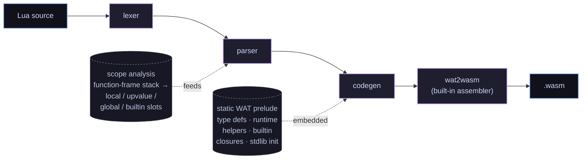

# lua2wasm

**An ahead-of-time compiler that turns Lua 5.5 source into standalone WebAssembly modules — no interpreter, no bytecode VM, no bundled garbage collector.**

`lua2wasm` is written in C23 and emits WebAssembly that leans on the modern WASM
type system (the GC, typed-references, and exception-handling proposals). The
runtime *is* the host: Lua tables are real WASM structs, Lua closures are
typed function references, and the browser's V8/SpiderMonkey collector owns
every Lua value. Compile once, ship a `.wasm`, run anywhere with a recent
browser.

> This is a research / educational project. The long-form mission, non-goals,
> and roadmap live in [`GOAL.md`](GOAL.md).

## Try it now

**Live playground:** <https://rhmoller.github.io/lua2wasm/> — opens an
in-browser editor that compiles and runs your Lua right on the page. No
install needed.

For local development the default flow needs **no Emscripten** and **no
Binaryen** — just `clang`, `cmake`, and Node ≥ 22. The WAT→wasm assembler
is built into the compiler.

```sh
# 1. Build the compiler (a native binary)
CC=clang cmake -S . -B build -G Ninja
cmake --build build

# 2. Compile a Lua program straight to a .wasm module
echo 'print("hello from " .. "lua2wasm")' > /tmp/hello.lua
./build/lua2wasm /tmp/hello.lua -o /tmp/hello.wasm

# 3. Run it
node --experimental-wasm-exnref runtime/host.mjs /tmp/hello.wasm
#   → hello from lua2wasm
```

(Use `-o /tmp/hello.wat` to emit human-readable text instead; the standalone
`wat2wasm` binary assembles `.wat` → `.wasm` if you want the two-step flow.)

Or wrap that module up as a self-contained HTML page (no server needed) with
[`scripts/package-html.sh`](scripts/package-html.sh) — see the
[Packaging](#packaging) section below.

### Optional: the live playground

If you also have [Emscripten](https://emscripten.org/) on hand, there's a
richer demo that cross-compiles **the compiler itself** to WASM and ships it
to the browser. CodeMirror editor on one side, output on the other, with
a draggable splitter between them. **Run** compiles + runs your Lua entirely
client-side; **Show WAT** flips the output to a syntax-highlighted view of the
generated WebAssembly text, with foldable sections separating prelude /
stdlib / user code / data segments. Catppuccin theming throughout, with a
sun/moon toggle to flip between Mocha (dark) and Latte (light).

```sh
. ~/path/to/emsdk/emsdk_env.sh
./scripts/build-wasm.sh                  # produces build-em/lua2wasm.{js,wasm}
python3 -m http.server 8000
# open http://localhost:8000/runtime/playground.html
```

Emscripten is *only* needed for this playground page — every other path in
this README works without it.

## A tiny example

```lua
local function counter()
  local n = 0
  return function() n = n + 1; return n end
end

local tick = counter()
print(tick())   -- 1
print(tick())   -- 2
print(tick())   -- 3
```

That compiles to a ~5 KB `.wasm` module. The closure becomes a real
`(ref $LuaClosure)` — a WASM struct holding a typed `funcref` plus an array
of captured upvalue boxes — and is *called* through `call_ref`, the WASM
indirect-call instruction for typed function references. The captured `n` is
shared by reference (a struct cell), not copied, so multiple closures over
the same outer scope mutate the same slot — exactly as Lua specifies.

## What works today

`lua2wasm` is an AOT compiler. There's no Lua interpreter sitting around at
runtime; what you write is what the compiler *statically* lowers to WASM
instructions. Anything not in this table is a compile-time error.

| Area              | Supported                                                                                                                                                                                                                                                                       | Not yet                                                          |
|-------------------|---------------------------------------------------------------------------------------------------------------------------------------------------------------------------------------------------------------------------------------------------------------------------------|------------------------------------------------------------------|
| **Values**        | `nil`, booleans, integers, floats, strings, tables, first-class functions / closures                                                                                                                                                                                                                            | userdata, threads                                                |
| **Numbers**       | int + float subtypes with Lua-compliant promotion (`/` always float, `+ - *` keep int if both ints, `//` floor-div, `%` floor-mod, `^` always float, hex int `0xFF` / `0Xff` (wraps mod 2^64 like reference Lua — `0x13121110090807060504030201` denotes its low 64 bits), hex float `0x1.8p3`, bitwise `& \| ~ << >>` and unary `~` on 64-bit ints with float-to-integer coercion)                            | —                                                                |
| **Strings**       | single / double-quoted with full escape set (`\n \t \\ \" \' \0 \a \b \f \r \v \xHH \ddd \u{…} \z \<line-break>`), **long-bracket `[[ ... ]]`** and level-N `[=[ ... ]=]`, concat `..` (with `__concat`), length `#` (with `__len`), structural equality                                                         | —                                                                |
| **Tables**        | array part + hash part, positional / named / `[expr]=` constructors, `t.k` and `t[k]` read+write, nil-assignment delete, `#t` border rule, nesting, identity equality via `ref.eq` (table keys work as in Lua)                                                                                                  | metatable performance tricks                                     |
| **Locals**        | `local x`, `local x, y, z = …`, lexical block scoping, shadowing, **`<const>` (compile-time reassignment error)** and **`<close>` (calls `__close(value, nil)` in reverse declaration order at natural block exit; nil/false skip)**                                                                                                                                                                                                                              | `<close>` cleanup on `return`/`break`/error exits inside the block |
| **Globals**       | Lua-traditional implicit globals — `num = 42` at top level just works; reading an undeclared name yields `nil`. Explicit `global x` declarations also supported. **`_G` is a real `$LuaTable` aliasing every global**: builtins, library tables, user globals all live there, `_G._G == _G`, `pairs(_G)` iterates them. Reassigning a builtin (e.g. `print = my_print`) writes a new `_G` entry — the original closure remains reachable through `getmetatable` / locals capturing it. | strict mode (`global <const> *` opt-in)                          |
| **Statements**    | `local`, `local function`, **top-level `function f() end`** incl. dotted (`function T.x.y() end`) and method (`function T:m() end`) forms, multi-assign, `if/elseif/else`, `while`, `for i = a,b[,c]`, generic `for k[,v,…] in …`, `repeat ... until`, `break`, **`goto NAME` / `::NAME::`**, bare `do`, expression-statement, `return e1, …` | —                                                                |
| **Operators**     | `+ - * / // % ^`, `& \| ~ << >>` (binary) and `~` (unary, bitwise NOT), `== ~= < <= > >=`, `and or not`, `..`, `#`                                                                                                                                                                                              | —                                                                |
| **Functions**     | N-ary arguments, multiple return values (`return a, b, c`), upvalue capture (mutable shared boxes), transitive captures, **method-call sugar `obj:m(args)`**, **paren-less single-arg call `f"x"` / `f{k=1}`**, **varargs `function f(...)` / `function f(a, ...)` with `...` spliced into call args, returns, table constructors, and multi-assign**, proper tail calls (`return f(...)` → `return_call_ref`, doesn't grow the stack)                  | —                                                                |
| **Errors**        | `error(v)` / `pcall(f, …)` / `assert(v[, msg])` lowered to WASM exception handling (`throw $LuaError` + `try_table`). Internal builtins raise spec-shaped messages with the standard `<src>:<line>:` position prefix — `attempt to perform arithmetic`, `attempt to index a value`, `invalid UTF-8 code`, `data does not fit`, `out of limits`, `variable-length format`, `not power of 2`, `table overflow` (raised before WASM array-size traps so `pcall` can catch runaway allocations), `stack overflow` (a `$call_depth` guard raises it catchably before deep non-tail recursion exhausts the host call stack), etc. | full traceback (`debug.traceback` returns the current frame only) |
| **Metatables**    | `setmetatable` / `getmetatable`, `__index` (table chain *and* function form, with cycle limit), `__newindex` (table chain *and* function form), `__add` `__sub` `__mul` `__div` `__mod` `__pow` `__unm` `__idiv` `__band` `__bor` `__bxor` `__shl` `__shr` `__bnot`, `__concat`, `__len`, `__eq` `__lt` `__le`, `__call`, `__tostring`, `__name` (renames the type in `tostring` and type-aware error messages), `__metatable` (protect)                                                                                                                                              | `__close` on early exits (`return`/`break`/`goto`/error; natural block exit works), `__gc` (no finalizers in WasmGC), `__mode` (no weak refs in WasmGC) |
| **Standard lib**  | `print`, `error` (full position prefix `<src>:<line>: ` via the level arg; level 0 disables it), `pcall`, `xpcall`, `warn`, `assert` (auto-prefixes too), `select`, `type`, `tostring`, `tonumber`, `ipairs`, `pairs`, `next`, `setmetatable`, `getmetatable`, `rawequal`, `rawlen`, `rawget`, `rawset`, `collectgarbage` (stub — no real Lua GC, but `"incremental"`/`"generational"` round-trip the previous mode), `_G`, `_VERSION`; `debug.{traceback, getmetatable, setmetatable, gethook}`; **`require` + `package.{loaded, preload}`** (static `-m FILE` modules at compile time — see CLI section); `io.{write, read, output, input}` (`io.output([f])` / `io.input([f])` query or set the default file; bare `io.write` / `io.read` route through it) plus **`io.stdout` / `io.stderr` / `io.stdin` file handles** with `:write` / `:read` / `:close` / `:flush` methods (`close`/`flush` are no-ops on the standard streams; stderr writes route to the host's stderr); **real files via `io.open` / `io.lines` / `io.type`** returning handles with `:read` (`l`/`L`/`a`/`n`/N-byte) / `:write` / `:seek` (`set`/`cur`/`end`) / `:flush` / `:close` / `:lines` — backed by `node:fs` under Node and by [just-bash](https://github.com/vercel-labs/just-bash)'s in-memory FS in the playground (bridged through JSPI, persists for the page session); `os.{time, clock, date, difftime, getenv, exit, execute, remove, rename, tmpname, setlocale}` — light shims over the host. `os.difftime(t2,t1)` returns the second difference as a float; `os.setlocale` supports the portable `"C"` locale (other locale names → nil). `os.time`/`os.clock` are real, `os.date` covers a strftime subset (`%Y %m %d %H %M %S %j %p %w %y %c %x %X %%`) plus the `*t` / `!*t` table form, `os.execute()` reports "shell available" and `os.execute(cmd)` returns `(nil, "exit", 1)`, `os.{remove, rename}` act on the host filesystem and return `(nil, msg)` on failure; `math.{floor, ceil, abs, sqrt, min, max, sin, cos, tan, asin, acos, atan, exp, log, pi, huge, deg, rad, fmod, modf, tointeger, type, ult, maxinteger, mininteger, random, randomseed}` (`atan`/`log` accept a second arg; numeric-string args coerce like the operators, and a non-number raises a catchable `number expected`); `string.{len, sub, format, upper, lower, reverse, rep, byte, char, find, match, gmatch, gsub, pack, unpack, packsize}` (`format` covers all of `%s %d %i %u %o %x %X %c %q %e %E %f %F %g %G %a %A %%` with flags `- + space # 0`, width, precision; pattern subsystem covers every documented class, set, quantifier, anchor, capture, back-ref, `%bxy` balanced match, `%f[set]` frontier; gsub accepts string/table/function repl; pack/unpack/packsize cover every option in §6.5.2 — `< > = ! [n] b B h H l L j J T i[N] I[N] f d n c[N] z s[N] x Xop` — and round-trip byte-for-byte with reference Lua, including `data does not fit` overflow detection on `>8`-byte ints in either direction); `table.{insert, remove, concat, unpack, pack, move, create, sort}`; `utf8.{char, len, codepoint, offset, codes, charpattern}` (codes raises `invalid UTF-8 code` with file:line on bad bytes); `load` returns `(nil, "no load")` since lua2wasm is AOT — no runtime compiler ships with the module; `loadfile` is not implemented | real coroutines |
| **Coroutines**    | —                                                                                                                                                                                                                                                                                                               | blocked on the WASM stack-switching proposal shipping in browsers |

Browse [`tests/fixtures/`](tests/fixtures/) to see what valid programs look
like across each capability area.

## How we use modern WebAssembly

The whole point of `lua2wasm` is to take the new WASM proposals seriously —
**not** as a portable assembler with a hand-rolled allocator on top, but as a
managed runtime that already has most of what a dynamic language needs.

| WASM feature                                  | What we use it for                                                                                                                                          |
|-----------------------------------------------|-------------------------------------------------------------------------------------------------------------------------------------------------------------|
| **GC: `struct` and `array` types**            | Every Lua value is a host-GC object. `$LuaString` wraps `(array i8)`, `$LuaTable` is a struct of (keys, vals, n, cap, meta), `$LuaClosure` is a struct of (funcref, upvalues). **No linear memory.** No bundled allocator. The browser's GC owns lifetime. |
| **`i31ref`**                                  | Unboxed small integers. Lua ints in the 31-bit range live as tagged immediates with zero allocation; only overflowed ints get boxed in `$LuaInt`.            |
| **Typed function references + `call_ref`**    | Closures are *real* references, not table-of-functions indices. Every function call goes through `call_ref` on a `(ref $LuaFn)` extracted from the closure struct. |
| **`return_call_ref` (tail calls)**            | `return f(...)` lowers to `return_call_ref`. Deep recursion (e.g. 20 000-step countdown) doesn't grow the WASM call stack — a property the JS embedding can't offer. |
| **Mutually-recursive types (`rec` blocks)**   | `$LuaClosure` references `$LuaFn`, `$LuaFn` mentions `$LuaClosure`. We declare them in a single recursion group so the type system accepts the cycle. Same trick for `$LuaTable` referencing itself via its metatable field. |
| **Reference-type tests / casts**              | Dynamic dispatch (e.g. `print` of arbitrary values, or `+` falling back to `__add`) uses `ref.test (ref $LuaTable)`, `ref.cast`, `ref.is_null` to switch on the type without a tag word. |
| **Exception handling (`tag` + `throw` + `try_table`)** | `error(v)` is `throw $LuaError v` carrying the error as an `anyref` payload. `pcall(f, ...)` is `try_table` with a single catch label that lands the error value on a block exit. Real call-stack unwinding, no setjmp/longjmp emulation. |
| **`array.new_data` from data segments**       | String literals are materialized in a single shared data segment; constructing a `$LuaString` is one `array.new_data` instruction that copies the byte range out. |
| **`array.copy` between GC arrays**            | String concat and table-array resizing copy ranges between GC-managed `(array …)` instances directly — no manual loop, no memcpy, no linear-memory staging. |
| **`anyref` + null tracking in the type system** | Lua values flow as `anyref`. Non-nullable refs (`(ref $X)` vs `(ref null $X)`) are tracked separately so the validator catches whole classes of NPE-style bugs in our generated code at module-instantiation time. |
| **`(start)` *not* used**                      | We *deliberately don't* run code at instantiation time, so the JS host can wire up its decoder helpers before `main()` is called — otherwise imports couldn't see the module's own exports. |
| **JS Promise Integration** (`WebAssembly.Suspending` / `WebAssembly.promising`) | *Playground only.* `io.read` and the filesystem imports (`io.open`/`io.lines`/`os.remove`/…, backed by just-bash's async in-memory FS) are wrapped as suspending imports and `main` as a promising export, so synchronous Lua I/O transparently awaits the async host underneath. No change to the compiled `.wasm`; pure host-side. Falls back to EOF / soft I/O failure when the host lacks JSPI. |

The practical consequence: a typical compiled module is **a few KB**. The
host has zero Lua-specific runtime; everything that *is* the Lua VM lives in
the produced `.wasm`. A program that defines a closure and calls it once
fits in 5 KB; the full milestone-8 OO demo fits in 5.5 KB.

## Performance

Does the "no linear memory, everything is a host-GC object" model cost
runtime speed? **It doesn't have to.** Hand-writing the *ideal* WAT for a
numeric loop — plain `i64`/`f64` locals, no boxing — runs at par with (or
faster than) reference Lua 5.5's bytecode interpreter on V8. The baseline gap
is *representation overhead*, not the execution substrate: boxed floats,
per-call argument/result arrays, and generic `anyref` dispatch through runtime
helpers. So it's recoverable by generating better code.

An opt-in specialization pass (set `LUA2WASM_OPT_INT=1` when compiling) closes
it for monomorphic code. **Default output is unchanged** — byte-identical with
the flag off — so the optimization is purely additive. Measured under Node/V8,
timed inside the script with `os.clock()` so process startup is excluded
(numbers vary by machine; compare the columns, not the absolutes):

| tight-loop workload      | reference `lua5.5` | lua2wasm (default) | lua2wasm (`LUA2WASM_OPT_INT`) |
|--------------------------|-------------------:|-------------------:|------------------------------:|
| 20M integer ops          | 0.07 s             | 0.36 s             | **0.05 s** |
| 20M float ops            | 0.05 s             | 0.38 s             | **0.05 s** |
| 20M function calls       | 0.22 s             | 0.55 s             | **0.04 s** |
| recursive `fib(34)`      | 0.18 s             | 0.31 s             | **0.05 s** |
| 5M `t[i]=i` then sum     | 0.06 s             | 0.24 s             | **0.14 s** |

What the pass does, all within the WasmGC model (no linear memory, no deopt):

- **Unboxes locals, parameters, returns, and recursion.** A whole-program
  fixpoint infers which slots, function parameters, and return values are
  monomorphically `int` or `float`, and declares them as raw `i64`/`f64`.
  Integer and float are kept *distinct* (Lua semantics: `3*3` is `9`, `3.0*3.0`
  is `9.0`), so a value seen as both stays boxed.
- **Specializes arithmetic and comparisons** to native `i64`/`f64` opcodes;
  comparisons in `if`/`while`/`repeat` use the `i32` result directly, skipping
  the boxed boolean and the truthiness helper.
- **Direct calls.** A call to a statically-bound local function — including a
  self-recursive one — goes to a typed entry that takes unpacked, unboxed
  arguments and returns an unboxed value, skipping the per-call argument and
  result arrays. End to end, `s = s + f(i)` in a loop compiles to an `i64.add`
  over a direct call with no allocation.

Independently, tables use a **hybrid array + hash representation** (always on,
not gated): integer keys `1..n` live in a dense array part for O(1) sequential
access, with everything else in an open-addressing hash — the same shape
reference Lua uses. Genuinely dynamic table values still box, so a `sum += t[i]`
loop stays a few times off reference; numeric scalar code is where the model
shines.

The honest ceiling: genuinely *dynamic* float or big-integer code **must** box
(WasmGC has no way to put a raw `f64`/64-bit int in an `anyref`, and NaN-boxing
needs linear memory — which this project forbids), and an AOT compiler with no
deoptimization can't speculate the way a tracing JIT does. Conservative static
specialization plus a boxed generic fallback is the model's ceiling — and for
ordinary numeric and call-heavy code, that ceiling is at or below reference Lua.

## Targets

Anything with current WASM-GC + reference-types + exception-handling
support runs every compiled module:

- **Chrome / Edge** ≥ 137 — works out of the box, no flags
- **Firefox** ≥ 131 — works out of the box, no flags
- **Safari** ≥ 18.4 — works out of the box, no flags
- **Node** ≥ 22 — needs `--experimental-wasm-exnref` (still gated as of Node 24); future Node releases are expected to default it on

The new exception-handling proposal (with `exnref` / `try_table`) is the
only opcode family in our compiled output that's still flag-gated
*anywhere*. It's shipped in every current browser by default; the Node
holdout is a runtime config detail, not a missing implementation.

### Optional: JSPI for interactive `io.read` in the playground

[`runtime/playground.html`](runtime/playground.html) uses **JavaScript
Promise Integration** (`WebAssembly.Suspending` + `WebAssembly.promising`)
to let `io.read` suspend the running wasm while it awaits a typed line in
the output pane. Status is the same as exnref:

- Chrome / Edge ≥ 137 — default-on
- Firefox / Safari recent — default-on (track the [JSPI proposal](https://github.com/WebAssembly/js-promise-integration) for the latest)
- Node — behind `--experimental-wasm-jspi` (not used by our CLI host)

When JSPI is unavailable the playground silently falls back to returning
EOF from `io.read` — every other feature keeps working. Nothing in the
compiled `.wasm` itself depends on JSPI; it's purely a host-side feature
that lets a synchronous-looking wasm import resolve a promise.

Compiled modules need no other runtime files. They `import "host"` for `print`
only — and even that can be replaced with whatever host imports your
embedding cares about.

## Building from source

```sh
CC=clang cmake -S . -B build -G Ninja
cmake --build build
ctest --test-dir build --output-on-failure
```

Requirements (required vs optional):

| Tool       | Version  | Required for                                                                                                                         |
|------------|----------|--------------------------------------------------------------------------------------------------------------------------------------|
| `clang`    | ≥ 19     | building the native compiler binary (C23 `#embed` requires clang ≥ 19)                                                              |
| `cmake`    | ≥ 3.25   | building the native compiler binary                                                                                                  |
| `node`     | ≥ 22     | running compiled `.wasm` modules from the command line (Browser hosts work equivalently, no Node needed there)                       |
| `binaryen` | recent   | **optional** — `wasm-as` is used only as a differential oracle by the `wat2wasm` unit tests; the compiler ships its own WAT→wasm assembler |
| `emcc`     | ≥ 4.0    | **optional** — only for cross-compiling the compiler itself to WASM so the playground page can call it. Skip if you don't need the playground. |

## Using the CLI

```sh
./build/lua2wasm input.lua -o output.wasm   # binary module (use -o output.wat for text)
```

Run under Node:

```sh
node --experimental-wasm-exnref runtime/host.mjs output.wasm
```

Multi-file programs are linked at compile time via `-m`:

```sh
./build/lua2wasm main.lua -m util.lua -m wrap.lua -o output.wat
```

Each `-m FILE` becomes a require()-able module keyed by `basename(FILE)`
sans `.lua`. `require("util")` in any source (entry or module) walks
`package.preload`, calls the loader on first hit, and caches the result
in `package.loaded` — the standard Lua semantics, statically wired.

To enable the experimental numeric/call specialization pass (see
[Performance](#performance)), set the environment variable when compiling;
it only changes the emitted code, not the CLI invocation:

```sh
LUA2WASM_OPT_INT=1 ./build/lua2wasm input.lua -o output.wat
```

## Packaging

`scripts/package-html.sh` wraps a compiled `.wasm` into a single
self-contained HTML page — base64-embeds the module plus a tiny host loader,
about 10 KB of HTML overhead. The result needs no server and no other
files.

```sh
./scripts/package-html.sh output.wasm -o output.html
# open output.html — runs in any GC-capable browser
```

## Architecture (in 30 seconds)



| Source file              | Job                                                                                              |
|--------------------------|--------------------------------------------------------------------------------------------------|
| `src/lexer.{c,h}`        | Hand-written lexer for the full Lua 5.5 lexical surface                                          |
| `src/parser.{c,h}`       | Recursive-descent + Pratt expressions; scope and upvalue analysis                                |
| `src/ast.{c,h}`          | Tagged-union AST with a bump-allocator pool                                                      |
| `src/codegen.{c,h}`      | Emits WAT to a `WatBuilder`; embeds a static runtime prelude                                     |
| `src/builtins.{c,h}`     | Single source of truth for builtin names → wasm function symbols                                 |
| `src/wat_builder.{c,h}`  | Dynamic string buffer for WAT emission                                                            |
| `src/wat2wasm.{c,h}`     | Self-contained WAT→wasm binary assembler (library + standalone `wat2wasm` CLI; no Binaryen)      |
| `src/emscripten_entry.c` | One-function entry point used when the compiler is itself compiled to WASM for the playground   |
| `runtime/host.mjs`       | Reference host: instantiates a compiled module and renders `print` output                        |
| `runtime/playground.html`| CodeMirror editor + in-browser compile + built-in wat→wasm + execute                            |
| `tests/`                 | µnit unit tests + bash end-to-end fixtures + the `wat2wasm` assembler harness (currently 131 in CTest, all green); `scripts/smoke-official-tests.sh` runs the AOT pipeline over every file in [`official-tests/lua-5.5.0-tests/`](https://www.lua.org/tests/) for a compatibility scorecard |

## Deferred / planned

Cards in roughly priority order. Open a discussion before tackling
anything large.

1. `<close>` cleanup on early exits — `__close` runs at natural block exit; `return` / `break` / `goto` / error unwinds through a scope still skip it. Completing it needs an active-close-scope stack in codegen plus per-scope `try_table` unwinding — a milestone, not a small fix.
2. Full `debug.*` library + multi-frame traceback (today `debug.traceback` returns the current frame only; `debug.getinfo` is unimplemented — its `nparams`/`nups`/`isvararg`/`linedefined` fields need per-function metadata a no-bytecode AOT compiler doesn't retain).
3. `load` (stub returns `(nil, "no load")`) / `loadfile` (unimplemented) — full dynamic loading would need the compiler itself shipped at runtime. (`require` already works via `-m FILE` modules baked in at compile time.)
4. Dynamic error messages with the offending value embedded (e.g. `"invalid format option 'r'"` instead of just `"invalid format"`).
5. Coroutines — blocked on the WASM stack-switching proposal landing in browsers.
6. Source maps so DevTools can step from compiled WASM back into Lua.
7. `wasm-opt` step in the *CLI* build pipeline. The playground already runs Binaryen optimization opt-in; the CLI flow assembles with the built-in `wat2wasm` and stops there (no optimization pass).

## Contributing

Commits follow [Conventional Commits](https://www.conventionalcommits.org/).
Common types in this repo: `feat:`, `fix:`, `refactor:`, `test:`, `docs:`,
`chore:`, `build:`. Use a scope when it helps,
e.g. `feat(parser): handle long-string literals`.

New language features land behind an end-to-end fixture before they land as
syntax in the parser. *If you can't print it, you didn't build it.*

## License

MIT — see [LICENSE](LICENSE).
